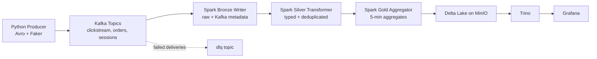

# StreamPulse

StreamPulse is a local, end-to-end streaming analytics project for e-commerce-style events.
It generates Avro events, streams them through Kafka, processes them with Spark Structured Streaming, stores them in Delta Lake on MinIO, and serves dashboard queries through Trino + Grafana.

## Overview

The project is split between infrastructure in Docker and a Python producer you run locally:

- Infrastructure (`streampulse/docker-compose.yml`): Kafka, Schema Registry, Spark, MinIO, Trino, Grafana, Prometheus, Kafka UI
- Producer (`streampulse/producer`): generates clickstream, order, and session events
- Streaming jobs (`streampulse/spark/jobs`): Bronze → Silver → Gold processing

Gold outputs used by the dashboard:

- `revenue_by_5min`
- `top_products`
- `conversion_funnel`
- `active_users`

## Architecture and Data Flow



## Repository Layout

```text
.
├── README.md
├── streamPulse_architecture.png
└── streampulse/
    ├── docker-compose.yml
    ├── docker-compose.override.yml
    ├── .env
    ├── config/kafka/topics.ps1
    ├── scripts/health_check.ps1
    ├── scripts/stress_test.ps1
    ├── producer/
    ├── spark/
    ├── trino/
    ├── grafana/
    └── monitoring/
```

## Prerequisites

- Windows with PowerShell
- Docker Desktop
- Python 3.11+ (for local producer)

Recommended: at least 8 GB RAM available to Docker.

## Setup and Run (PowerShell, Windows)

Run from the repository root:

```powershell
cd .\streampulse

# Start infrastructure
docker compose up -d --build

# Create required Kafka topics
.\config\kafka\topics.ps1
```

Start the producer in a second PowerShell window:

```powershell
cd .\streampulse\producer
python -m venv .venv
.\.venv\Scripts\Activate.ps1
pip install -r .\requirements.txt
python .\main.py
```

Useful URLs:

- Grafana: http://localhost:3000 (admin / streampulse)
- Kafka UI: http://localhost:8080
- MinIO Console: http://localhost:9001
- Spark Master UI: http://localhost:8090
- Prometheus: http://localhost:9090
- Trino UI/API: http://localhost:8085

## Validation Steps

From `.\streampulse`:

```powershell
# Service + topic + bucket checks
.\scripts\health_check.ps1

# Consumer lag details
docker exec streampulse-kafka kafka-consumer-groups `
  --bootstrap-server localhost:9092 `
  --describe --group streampulse-spark
```

Optional load test (uses producer virtual environment at `producer\.venv`):

```powershell
.\scripts\stress_test.ps1 -DurationSeconds 300 -EventsPerSecond 10000
```

## Troubleshooting

### `topics.ps1` fails or reports container not found

Kafka is not healthy yet. Wait for Docker services to stabilize, then re-run:

```powershell
docker compose ps
.\config\kafka\topics.ps1
```

### Producer cannot connect to Schema Registry or Kafka

Confirm these endpoints are reachable:

- `http://localhost:8081/subjects` (Schema Registry)
- Kafka on `localhost:9092`

Then verify `streampulse\producer\config.py` defaults or env overrides.

### `stress_test.ps1` exits with "Virtual environment not found"

The script expects `streampulse\producer\.venv\Scripts\python.exe`.
Create it first:

```powershell
cd .\streampulse\producer
python -m venv .venv
.\.venv\Scripts\Activate.ps1
pip install -r .\requirements.txt
```

### Grafana is up but panels are empty

Usually one of these is true:

- Producer is not running
- Topics were not created (`clickstream`, `orders`, `sessions`, `dlq`)
- Spark streaming job is restarting

Check:

```powershell
docker logs streampulse-spark-streaming --tail 100
.\scripts\health_check.ps1
```
